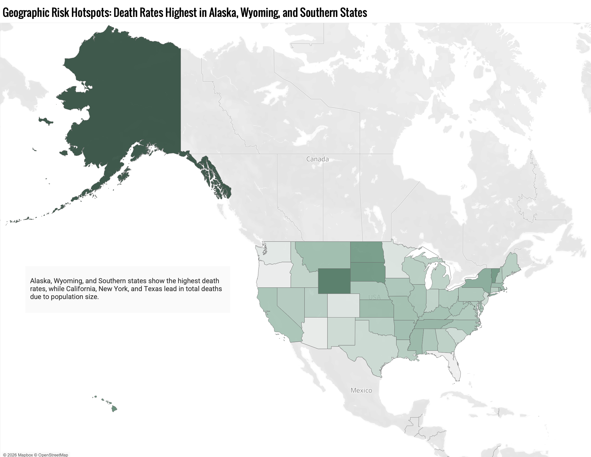
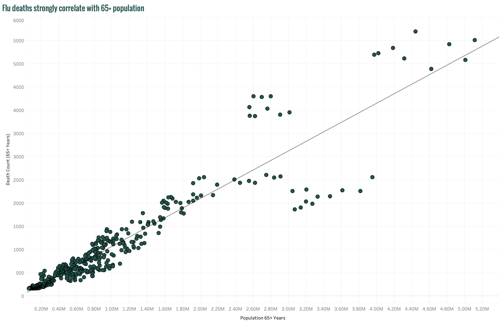
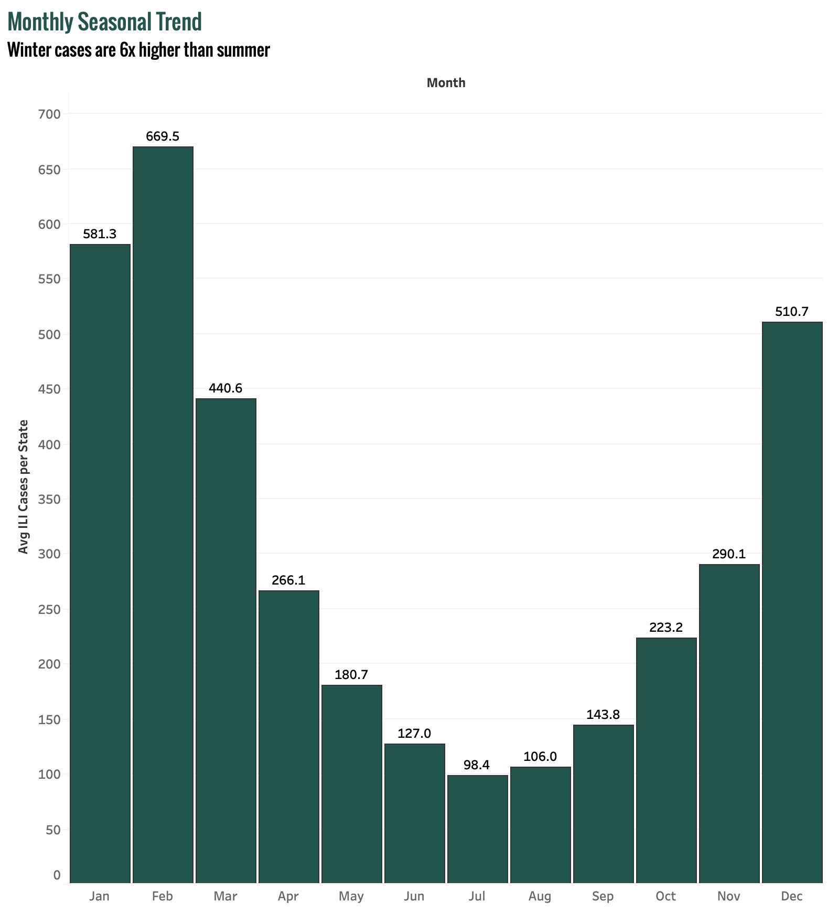

# Influenza Staffing Analysis

**Statistical analysis of CDC influenza mortality data to optimize medical staffing allocation across 50 states during flu season.**

---

## Project Background

A national medical staffing agency provides temporary healthcare workers to hospitals and clinics during flu season surges. The challenge: **staffing decisions are reactive**, with hospitals scrambling for workers after demand spikes rather than planning ahead. Misallocation leads to understaffing in high-risk areas and overspending in low-risk ones.

This analysis integrated four CDC and U.S. Census datasets (458 state-year observations across 50 states, 2009–2017) to identify which populations, states, and time periods require prioritized staffing and to build a forecasting model that enables proactive deployment 1–2 months ahead of peak season.

## Data Structure

Four datasets were merged using a concatenated State-Year key to create a single integrated dataset for analysis. Age groups were consolidated into High Risk (65+) and Low Risk (Under 65), and all death counts were standardized to rates per 100,000 population for fair cross-state comparison.

**Datasets integrated:**
- **CDC Influenza Mortality** (2009–2017) → state-level deaths by age group
- **U.S. Census Population** → demographics by state, year, and age
- **CDC Vaccination Coverage** → flu vaccination rates for 65+ population
- **CDC Influenza Visits** → monthly influenza-related healthcare visits by state

**Final dataset:** 458 state-year observations · 50 states + D.C. · 88.4% vaccination data completeness

## Executive Summary

Analysis revealed that **elderly population size is the single strongest predictor of influenza staffing demand** (R² = 0.88), far outperforming vaccination coverage as a forecasting variable. Seasonal patterns show a consistent 6x spike in winter months, and risk is concentrated in a small number of high-population states — enabling targeted, proactive deployment rather than broad national coverage.

### Top Findings

**1. Adults 65+ face 5.2x higher influenza death rates than the under-65 population.**
Mean death rate for seniors is 120.8 per 100,000 compared to 23.1 for younger adults (p < 0.0001, Welch's t-test). This statistically significant gap makes elderly population share the primary variable for staffing allocation decisions.

**2. Elderly population size predicts flu deaths with 88% accuracy (R² = 0.88).**
Deaths scale linearly with the 65+ population across all states, making this a reliable, simple forecasting input. States with the largest elderly populations — California, Pennsylvania, Texas, New York, Florida — consistently require the most resources.

**3. Winter demand is 6x higher than summer, peaking in February.**
Average ILI cases per state hit 669.5 in February versus 98.4 in July. The surge begins in December and sustains through March, meaning staffing must be pre-positioned by November to avoid reactive scrambling.

**4. Vaccination coverage does not reliably reduce staffing demand (R² = 0.15).**
States with high vaccination rates show no meaningful reduction in death rates compared to lower-coverage states. Vaccination should not be used to justify reducing staffing allocation in any state.

## Insights Deep Dive

### Population Risk

The 65+ population drives the vast majority of influenza mortality. Death counts in this group show an IQR of 859 compared to just 52 for the under-65 population, meaning state size and elderly concentration explain most of the variability in staffing needs. The top five states by absolute death count are California, Pennsylvania, Texas, New York, and Florida, and should anchor any staffing allocation model.

### Seasonal Patterns

Influenza-related healthcare visits follow a predictable annual cycle, with cases climbing sharply in December, peaking in January–February, and declining through April. The 6x difference between peak and trough months means staffing capacity must flex dramatically, and schedules should be finalized 1–2 months before the December surge based on historical trend data.

### Vaccination Paradox

Despite intuition, vaccination coverage shows minimal correlation with state-level mortality (R² = 0.15). States with over 70% vaccination rates among seniors showed comparable death rates to states below 65% coverage. This means staffing models should rely on population demographics, not vaccination rates, as the primary allocation variable.

## Recommendations

**Prioritize Elderly-Serving Facilities**
Deploy temporary staff to hospitals and clinics with high 65+ patient concentration. Focus resources on states with the largest elderly populations (CA, PA, TX, NY, FL) and scale staffing levels based on state-specific elderly population forecasts.

**Pre-Position Staff Before December**
Finalize winter staffing schedules by October–November using historical seasonal patterns. Maintain elevated capacity through March, then reduce non-essential staffing during summer months to control costs.

**Allocate by Population Demographics, Not Vaccination Rates**
Use elderly population size as the primary allocation variable (R² = 0.88). Do not reduce staffing estimates based on vaccination coverage. The correlation with mortality is too weak to justify reduced resources.

**Maintain Flexible Capacity**
Build float pools for rapid reallocation as real-time CDC data reveals early surge signals. Monitor monthly visit patterns to detect demand spikes and refresh forecasts annually with each new season's data.

## Tools & Skills

| Tool | Use |
|------|-----|
| Excel | Data integration, hypothesis testing, correlation analysis |
| Tableau Public | Interactive dashboard with geographic and temporal visualization |

**Analytical techniques demonstrated:** Multi-source data integration using concatenated keys · Welch's t-test for hypothesis testing (unequal variances) · Correlation analysis (R² regression) · Per-capita rate standardization · Seasonal trend analysis · Population-based forecasting model

## Deliverables

| Document | Description |
|----------|-------------|
| [Tableau Dashboard](https://public.tableau.com/app/profile/jess.duong/viz/InfluenzaBurdenVaccinationCoverage/InfluenzaStaffingAnalysis) | Interactive geographic heatmap, seasonal patterns, and staffing recommendations |
| [Interim Analysis Report](Data/Influenza_Interim_Report_FINAL_Jessica_Duong.pdf) | Full statistical methodology, hypothesis testing, and findings documentation |
| [Analysis Workbook](Data/intermediate_workbook_FINAL.xlsx) | Integrated dataset with all calculations and summary statistics |

## Author

**Jessica Duong**
Data Analyst | [LinkedIn](https://www.linkedin.com/in/jess-duong/) | [Portfolio](https://jess-duong.github.io/) | duong.t.jess@gmail.com

---

*Data source: CDC influenza mortality, U.S. Census population demographics, CDC vaccination coverage, and CDC influenza visit data (2009–2017). Analysis covers 458 state-year observations across 50 states + District of Columbia.*
